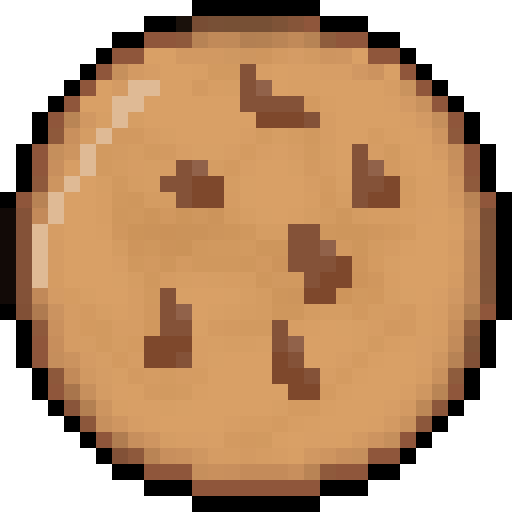

  <h1>Cookie Clicker README</h1>
  
A <b>global game</b> inside a profile readme.

<table align="center">
  <tr>
    <td align="center" valign="center" width="240">
			
			
      
    </td>
		<td align="center" valign="center" width="512">
      
       
      <strong>CLICK THE COOKIE</strong>
    </td>
  </tr>
</table>

How to add this to your profile?

	<ol>
		<li>Click on the repo (top left) if you're not inside of it.</li>
		<li>Fork the repo (top right)</li>
		<li>Name the repo to your profile name (if you want it to be displayed on your profile page, otherwise name it whatever)</li>
		<li>And</li>
	</ol>

<i>
Made by
<a href="https://github.com/p3cap">
	P3cap
</a>
/w
<a href="https://github.com/codex">
	Codex
</a>
</i>

